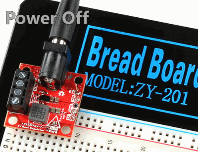

!!! hot "**Danger:** These boards can get extremely **HOT** :material-thermometer-alert:"
	
	Please handle these boards with the utmost caution. Users can easily burn themselves when the board outputs anything over 2A. 

## Headers

??? note "New to soldering?"
	If you have never soldered before or need a quick refresher, check out our [How to Solder: Through-Hole Soldering](https://learn.sparkfun.com/tutorials/how-to-solder-through-hole-soldering) guide.
	

		<a href="https://learn.sparkfun.com/tutorials/5">How to Solder: Through-Hole Soldering 
		</a>
	

The pins for the SparkFun **5V** Buck Regulator Breakout boards are broken out to 0.1"-spaced pins on the outer edges of the board. When selecting headers, be sure you are aware of the functionality and board orientation required.

<table class="pdf" style="border-style:none">
	<tr>
		<td align="center">
			 
			<i>Soldering headers to the 5V Buck Regulator (AP63357DV).</i>
		</td>
		<td align="center">
			 
			<i>Soldering headers to the 5V Baby Buck Regulator (AP63357DV).</i>
		</td>
	<tr>
</table>

-   <figure markdown>
	
	<figcaption markdown>
	Soldering headers to the 5V Buck Regulator (AP63357DV).
	</figcaption>
	</figure>

	??? tip "Jumper the Enable Pin"
		On the 5V Buck Regulator, users can solder headers to the [`VIN`](../hardware_overview/#power "Input Voltage") and [`EN`](../hardware_overview/#power-control "Enable Pin") pins so that they can be used with a [2-pin jumper](https://www.sparkfun.com/products/9044). The high-voltage enable (`EN`) pin can be shorted directly to the input voltage (`VIN`) to enable the power output.

		<figure markdown>
		
		<figcaption markdown>
		Headers soldered to jumper the `EN` and `VIN` pins on the 5V Buck Regulator.
		</figcaption>
		</figure>

-   <figure markdown>
	
	<figcaption markdown>
	Soldering headers to the 5V Baby Buck Regulator (AP63357DV).
	</figcaption>
	</figure>

	??? tip "Breadboard Use"
		When selecting headers for the BabyBuck regulator, the [right-angle headers](https://www.sparkfun.com/products/553) work great with breadboards.

		<figure markdown>
		
		<figcaption markdown>
		The 5V Baby Buck Regulator with right-angle headers and heat sink on a breadboard.
		</figcaption>
		</figure>

## Hookup Wire
??? note "New to soldering?"
	If you have never soldered before or need a quick refresher, check out our [How to Solder: Through-Hole Soldering](https://learn.sparkfun.com/tutorials/how-to-solder-through-hole-soldering) guide.
	

		<a href="https://learn.sparkfun.com/tutorials/5">How to Solder: Through-Hole Soldering 
		</a>
	

Users can also solder their wire connections directly to the pins of the SparkFun **5V** Buck Regulator Breakout boards. When planning out the connections, be sure you are aware of the functionality required.

!!! danger
	With higher current applications, users should ensure the wires can handle the current load. *(i.e. A 32AWG wire probably won't be able to handle 3.5A)*

<table class="pdf" style="border-style:none">
	<tr>
		<td align="center">
			 
			<i>Soldering wires to the 5V Buck Regulator (AP63357DV).</i>
		</td>
		<td align="center">
			 
			<i>Soldering wires to the 5V Baby Buck Regulator (AP63357DV).</i>
		</td>
	<tr>
</table>

-   <figure markdown>
	
	<figcaption markdown>
	Soldering wires to the 5V Buck Regulator (AP63357DV).
	</figcaption>
	</figure>

-   <figure markdown>
	
	<figcaption markdown>
	Soldering wires to the 5V Baby Buck Regulator (AP63357DV).
	</figcaption>
	</figure>

## Alternative Connections
!!! info  "Buck Regulator *(only)*"
	!!! warning "The following features are only available on the Buck Regulator and are <u>not</u> available on BabyBuck Regulator."

	=== "Barrel Jack PTH"
		??? note "New to soldering?"
			If you have never soldered before or need a quick refresher, check out our [How to Solder: Through-Hole Soldering](https://learn.sparkfun.com/tutorials/how-to-solder-through-hole-soldering) guide.
			

				<a href="https://learn.sparkfun.com/tutorials/5">How to Solder: Through-Hole Soldering 
				</a>
			

		To add a [barrel jack connector](https://www.sparkfun.com/products/119) to their board, users will need to solder it to the provided plated through hole slots.

		<figure markdown>
		[{ width="200" }](../img/hookup_guide/assembly-barrel_jack.jpg "Click to enlarge")
		<figcaption markdown>Soldering a [barrel jack connector](https://www.sparkfun.com/products/119) onto the 5V Buck Regulator.</figcaption>
		</figure>

	=== "Screw Terminals"
		A screw terminal is a great non-permanent solution, to connect the board. To use the screw terminals, simply insert the correct wires into the screw terminal opening and tighten the screw with a small flathead screwdriver for a firm connection.

		<figure markdown>
		[{ width="200" }](../img/hookup_guide/assembly-screw_terminal.jpg "Click to enlarge")
		<figcaption markdown>Connecting a wire to the 5V Buck Regulator's' screw terminal.</figcaption>
		</figure>

## Heat Sink
!!! info
    With larger heat sinks, we recommend a test fit and attaching it last to avoid conflicts with other parts of the board. For example, the heat sink could block the PTH pins/slots or access to the jumper pad.

To attach a [heat sink](https://www.sparkfun.com/products/18704) to the board, users will also need a piece of [thermal tape](https://www.sparkfun.com/products/17054). We recommend the following procedure:

1. Cut out a piece of [thermal tape](https://www.sparkfun.com/products/17054) to fit the bottom of the [heat sink](https://www.sparkfun.com/products/18704).
	
	!!! tip
		Covering the entire bottom of the heat sink can insulate the electrical contacts on the board from shorting.

    * For a perfect fit, users can place the heat sink over the tape and trace the outline to cut with scissors.
    * For a perfect fit, users can also place the heat sink over the tape and cut the outline with a [hobby knife](https://www.sparkfun.com/products/9200).

2. Place the piece of thermal tape on the bottom of the heat sink.

	!!! tip
		We recommend peeling off just one side of the backing sheet or [release liner](https://en.wikipedia.org/wiki/Release_liner) to place the thermal tape on the heat sink. Users can then peel the other side off when they are ready to place the heat sink on their board.
	
3. Attach the heat sink to the board.
    * Make sure to make any jumper modifications and/or solder any connections before placing the heat sink on the board.
    * Make sure to avoid any electrical contact with the sides of the heat sink.

<table class="pdf" style="border-style:none">
	<tr>
		<td align="center">
			 
			<i><a href="https://www.sparkfun.com/products/18704">Heat sink</a> attached to the 5V Buck Regulator (AP63357DV).</i>
		</td>
		<td align="center">
			 
			<i><a href="https://www.sparkfun.com/products/18704">Heat sink</a> attached to the 5V Baby Buck Regulator (AP63357DV).</i>
		</td>
	<tr>
</table>

-   <figure markdown>
	
	<figcaption markdown>
	[Heat sink](https://www.sparkfun.com/products/18704) attached to the 5V Buck Regulator (AP63357DV).
	</figcaption>
	</figure>

-   <figure markdown>
	
	<figcaption markdown>
	[Heat sink](https://www.sparkfun.com/products/18704) attached to the 5V Baby Buck Regulator (AP63357DV).
	</figcaption>
	</figure>

