!!! hot "**Danger:** These boards can get extremely **HOT** :material-thermometer-alert:"
	
	Please handle these boards with the utmost caution. Users can easily burn themselves when the board outputs anything over 2A. 

## Board Dimensions
The board dimensions are illustrated in the drawing below; the listed measurements are in inches.

<figure markdown>
[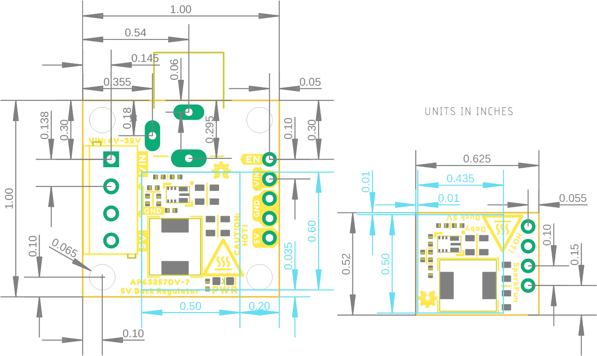{ width="400" }](../img/hookup_guide/dimensions-white.png "Click to enlarge")
<figcaption markdown>
[Board dimensions (PDF)](../board_files/dimensions.pdf) for the 5V buck regulator breakouts (AP63357), in inches.
</figcaption>
</figure>

??? tip "Need more measurements?"
	For more information about the board's dimensions, users can download the [eagle files](../board_files/eagle_files.zip) for the board. These files can be opened in Eagle and additional measurements can be made with the dimensions tool.

	??? info ":octicons-download-16:{ .heart } Eagle - Free Download!"
		Eagle is a [CAD]("computer-aided design") program for electronics that is free to use for hobbyists and students. However, it does require an account registration to utilize the software.

		

		[Download from :autodesk-primary:{ .autodesk }](https://www.autodesk.com/products/eagle/free-download "Go to downloads page"){ .md-button .md-button--primary width="250px" }
		

	
	??? info ":straight_ruler: Dimensions Tool"
		This video from Autodesk demonstrates how to utilize the dimensions tool in Eagle, to include additional measurements:

		

		

		<iframe src="https://www.youtube.com/embed/dZLNd1FtNB8" title="EAGLE Dimension Tool" frameborder="0" allow="accelerometer; autoplay; clipboard-write; encrypted-media; gyroscope; picture-in-picture" allowfullscreen></iframe>
		

		

## Power
Users are provided with [PTH](https://en.wikipedia.org/wiki/Through-hole_technology "Plated Through Holes") to connect their external power supply, the output voltage from the board, and the [`EN`](#power-control "Enable") power control pin for the buck regulator. The AP63357 buck regulator has an input voltage range is **3.8V** to **32V**. However, the boards require a **6V** minimum power supply to operate; as it is a step-down DC/DC converter with a 5V output. *(i.e. The boards cannot step-up or boost the voltage output.)*

<table class="pdf">
	<tr>
		<td align="center">
			<a href="../img/hookup_guide/buck-power_pins.jpg">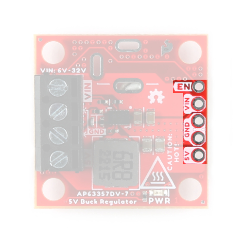</a> 
			<i>The PTH power pins on the 5V Buck Regulator (AP63357DV).</i>
		</td>
		<td align="center">
			<a href="../img/hookup_guide/baby-power_pins.jpg">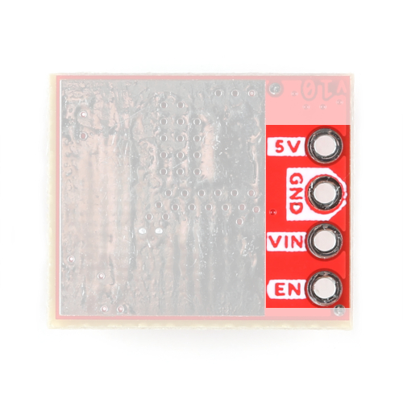</a> 
			<i>The PTH power pins on the 5V Baby Buck Regulator (AP63357DV), viewed from the bottom.</i>
		</td>
	<tr>
</table>

-   <figure markdown>
	
	<figcaption markdown>
	The PTH power pins on the 5V Buck Regulator (AP63357DV).
	</figcaption>
	</figure>

-   <figure markdown>
	
	<figcaption markdown>
	The PTH power pins the 5V Baby Buck Regulator (AP63357DV), viewed from the bottom.
	</figcaption>
	</figure>

Below, is a general summary of the circuitry on the board:

* **`VIN`** - Power supply input *(**6V to 32V**)*
    * The [undervoltage lockout](#undervoltage-lockout "UVLO") will engage intermittently if the input voltage is below **6V**.
* **`EN`** - Enables the power output of the board
	* Has an input voltage range up to **32V** 
	* Must be pulled `HIGH` above **1.18V** to enable the power output.
* **`5V`** - Regulated 5V output *(up to 3.5A)*
* **`GND`** - The common ground or the 0V reference for the board

!!! info
	For more details, users can reference the [schematic](../board_files/schematic.pdf) and the [datasheets of the individual components](../component_documentation.md) in the power circuitry.

!!! tip "Limitations - Load Current"
	* While the IC is rated up to 3.5A, users may experience thermal limitations towards that maximum.
		* Users should reasonably expect to be able to place a maximum 3A load on the boards when using a heat sink and active cooling (i.e. fan). 
		* At the peak load of 3.5A, users will need sufficient cooling to prevent the IC's [thermal shutdown](#thermal-characteristics "The AP63357 has a 170&deg;C (338&deg;F) thermal shutdown temperature.")
	* With a heat sink, we have found users can expect to draw up to 2.5A
	* Without a heat sink or active cooling, we recommend users not load the boards with more than 1.5A.

??? tip "Quiescent Current Draw"
    Users should expect a maximum quiescent current draw of ~365&micro;A from the board due to the voltage divider for the [UVLO](#undervoltage-lockout "Undervoltage Lockout"). For a lower quiescent current, users can modify the board by removing the voltage divider's resistors.

	

	-	Measured Values

		---

		

		
		| Input Voltage (V) | I~q~ (&micro;A) | I~q~ - Power Enabled (&micro;A) |
		| :-: | :-: | :-: |
		| 6 | 65 | 196 |
		| 12 | 129 | 209 |
		| 24 | 260 | 290.5 |
		| 32 | 330 | 355 |

		

		!!! info
			For more information about the measured values for the quiescent current, please refer to this [GitHub issue](https://github.com/sparkfun/SparkFun_Buck_Regulator_AP63357DV-7/issues/1).

	-	=== "Buck Regulator"
			
			<figure markdown>
			[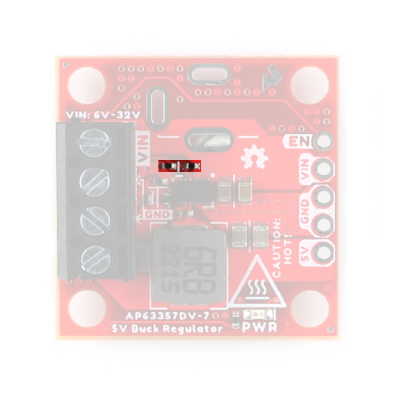](../img/hookup_guide/buck-uvlo_mod.jpg "Click to enlarge")
			<figcaption markdown>
			Resistors for the UVLO on the 5V Buck Regulator (AP63357DV).
			</figcaption>
			</figure>
	
		=== "BabyBuck Regulator"
			
			<figure markdown>
			[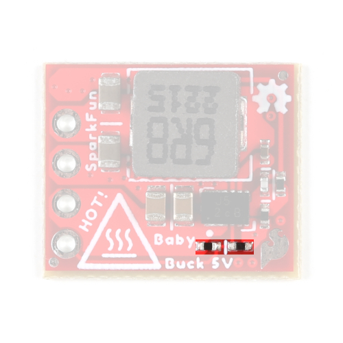](../img/hookup_guide/baby-uvlo_mod.jpg "Click to enlarge")
			<figcaption markdown>
			Resistors for the UVLO on the 5V Baby Buck Regulator (AP63357DV).
			</figcaption>
			</figure>
		
		!!! danger
			Modifying a board to remove the voltage divider, requires advanced soldering skills. Users should **not** attempt this modification unless it is absolutely, necessary and they are confident in their skills because the board can be permanently damaged.

	

### Alternative Connections

!!! info  "Buck Regulator *(only)*"
	!!! warning "The following features are only available on the Buck Regulator and are <u>not</u> available on BabyBuck Regulator."

	=== "Barrel Jack"
		PTH *(slots)* are provided for users to add a [barrel jack connector](https://www.sparkfun.com/products/119) to the top or bottom of the board. This provides users with an alternative method to connect a power supply to their board.

		<figure markdown>
		[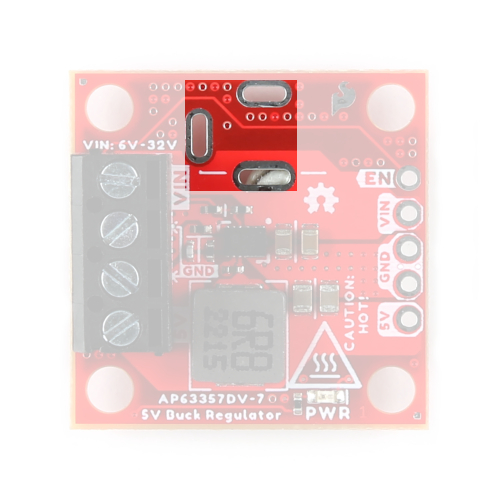{ width="200" }](../img/hookup_guide/buck-barrel_jack.jpg "Click to enlarge")
		<figcaption markdown>The plated slots for a barrel jack connector on the 5V Buck Regulator (AP63357DV).</figcaption>
		</figure>

	=== "Screw Terminals"
		A screw terminal is provided for users, as a non-permanent solution, to easily connect wires to the board. The screw terminal is compatible with the following wire sizes from **26AWG** to **16AWG**.

		<figure markdown>
		[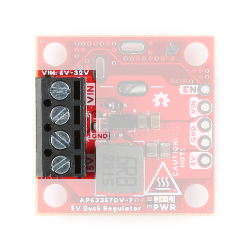{ width="200" }](../img/hookup_guide/buck-screw_terminal.jpg "Click to enlarge")
		<figcaption markdown>The screw terminal on the 5V Buck Regulator (AP63357DV).</figcaption>
		</figure>

### Power LED
The red, power (`PWR`) LED will light up when the switching power output is enabled. *(Not available on baby buck regulator board.)*

<figure markdown>
[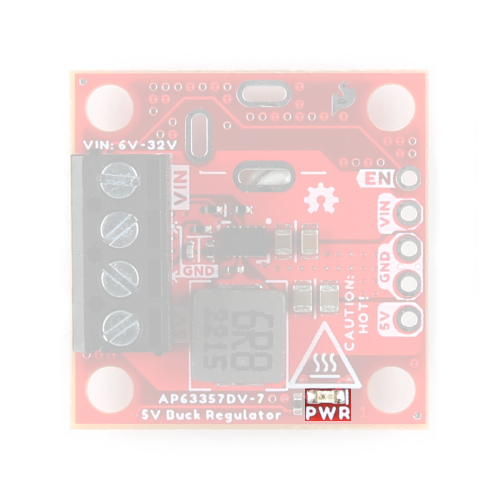{ width="200" }](../img/hookup_guide/buck-LED_pwr.jpg "Click to enlarge")
<figcaption markdown>
The `PWR` status LED indicator for the 5V Buck Regulator (AP63357DV).
</figcaption>
</figure>

### Power Control
There is a high-voltage enable pin (`EN`) to control the output voltage *(i.e. on/off)*, with a typical threshold voltage of **1.18V** and a range up to **32V**

* Users should pull the `EN` pin high *(above 1.18V)* to enable the switching power output and pull the pin low to disable it.
* As a high-voltage pin, users can also connect the `EN` pin to `VIN` to automatically start up the device.
* Users can also configure the `EN` pin to set the [UVLO](#undervoltage-lockout "Undervoltage Lockout") threshold.

!!! info "Default Configuration"
	On our boards, the `EN` pin to set the [UVLO](#undervoltage-lockout "Undervoltage Lockout") threshold. Therefore, the power output from the board is enabled by default.

<table class="pdf">
	<tr>
		<td align="center">
			<a href="../img/hookup_guide/buck-enable_pin.jpg">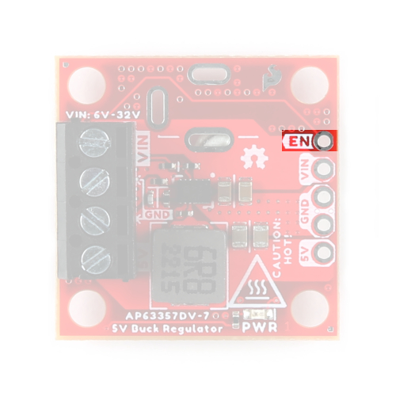</a> 
			<i>Enable pin on the 5V Buck Regulator (AP63357DV).</i>
		</td>
		<td align="center">
			<a href="../img/hookup_guide/baby-enable_pin.jpg">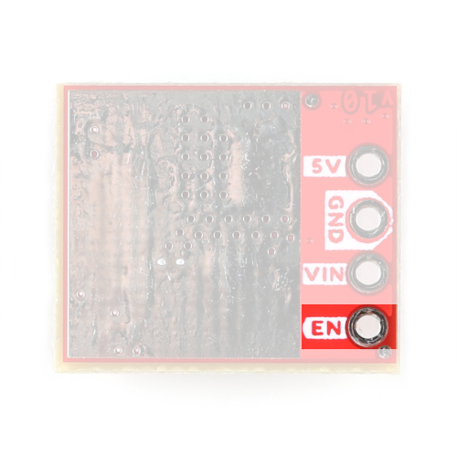</a> 
			<i>Enable pin on the 5V Baby Buck Regulator (AP63357DV), viewed from the bottom.</i>
		</td>
	<tr>
</table>

-   <figure markdown>
	
	<figcaption markdown>
	Enable pin on the 5V Buck Regulator (AP63357DV).
	</figcaption>
	</figure>

-   <figure markdown>
	
	<figcaption markdown>
	Enable pin on the 5V Baby Buck Regulator (AP63357DV), viewed from the bottom.
	</figcaption>
	</figure>

## AP63357
The [AP63357](../component_documentation/AP63356-AP63357.pdf) from [Diodes Incorporated](https://www.diodes.com/), is a 3.5A, synchronous buck converter with a wide input voltage range of 3.8V to 32V. The device fully integrates a 74m&ohm; high-side power MOSFET and a 40m&ohm; low-side power MOSFET to provide high-efficiency step-down DC-DC conversion. When operating in PFM during light load conditions, the AP63357 can achieve a power efficiency of up to 86% with a 5mA load. Additionally, under a no-load, non-switching condition, the quiescent current is typically 22&micro;A; and when disabled, the device shutdown supply current is only 1μA.

The AP63357 features a high-voltage `EN` pin that can be directly connected to `VIN` to automatically start up the device. To prevent output voltage overshoot and inrush current, the AP63357 also has a built-in 4ms soft-start time. Users can also configure the `EN` pin to set the [undervoltage lockout](#undervoltage-lockout "UVLO") threshold.

<table class="pdf" markdown="1">
<tr markdown="1">
<td rowspan="2" markdown="block">
Features:

* VIN 3.8V to 32V
* 3.5A Continuous Output Current
* 0.8V ± 1% Reference Voltage
* 22&micro;A Low Quiescent Current (Pulse Frequency Modulation)
* 450kHz Switching Frequency
* Supports Pulse Frequency Modulation (PFM)
	* Up to 86% Efficiency at 5mA Light Load
* Proprietary Gate Driver Design for Best EMI Reduction
* Frequency Spread Spectrum (FSS) to Reduce EMI
* Low-Dropout (LDO) Mode
* Power Good Indicator with 5MΩ Internal Pull-up
* Precision Enable Threshold to Adjust UVLO
* Protection Circuitry
	* Undervoltage Lockout (UVLO)
	* Output Undervoltage Protection (UVP)
	* Cycle-by-Cycle Peak Current Limit
	* Thermal Shutdown
</td>
<td align="center">
<a href="../img/hookup_guide/buck-AP63357.jpg">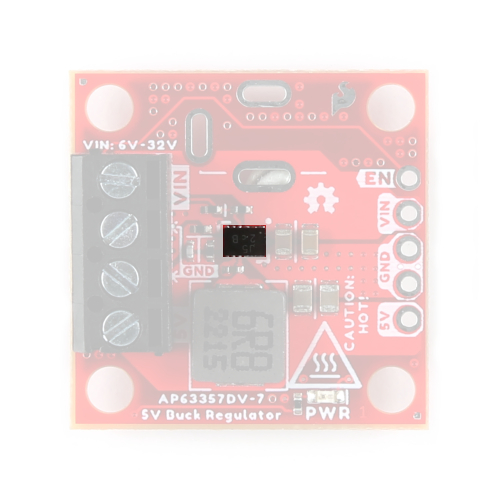</a> 
<i>AP63357 chip on the 5V Buck Regulator (AP63357DV).</i>
</td>
</tr>
<tr>
<td align="center">
<a href="../img/hookup_guide/baby-AP63357.jpg">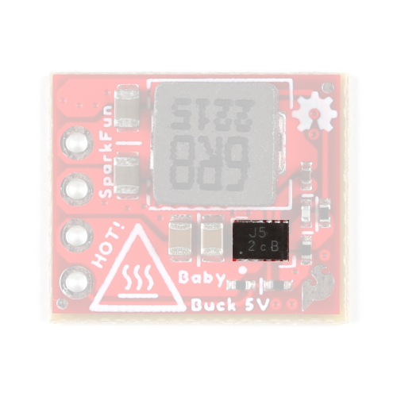</a> 
<i>AP63357 chip on the 5V Baby Buck Regulator (AP63357DV).</i>
</td>
<tr>
</table>

-   Features:

	* VIN 3.8V to 32V
	* 3.5A Continuous Output Current
	* 0.8V ± 1% Reference Voltage
	* 22&micro;A Low Quiescent Current (Pulse Frequency Modulation)
	* 450kHz Switching Frequency
	* Supports Pulse Frequency Modulation (PFM)
		* Up to 86% Efficiency at 5mA Light Load
	* Proprietary Gate Driver Design for Best EMI Reduction
	* Frequency Spread Spectrum (FSS) to Reduce EMI
	* Low-Dropout (LDO) Mode
	* Power Good Indicator with 5MΩ Internal Pull-up
	* Precision Enable Threshold to Adjust UVLO
	* Protection Circuitry
		* Undervoltage Lockout (UVLO)
		* Output Undervoltage Protection (UVP)
		* Cycle-by-Cycle Peak Current Limit
		* Thermal Shutdown

<section class="grid cards" markdown>

-	<figure markdown>
	
	<figcaption markdown>
	AP63357 chip on the 5V Buck Regulator (AP63357DV).
	</figcaption>
	</figure>

-   <figure markdown>
	
	<figcaption markdown>
	AP63357 chip on the 5V Baby Buck Regulator (AP63357DV).
	</figcaption>
	</figure>

</section>

??? tip "Power Efficiency"
	Users should expect a power efficiency close to the charts presented in Figures 3, 25, and 26 in the [datasheet](../component_documentation/AP63356-AP63357.pdf) *(i.e. 70% with smaller loads and up to 95% with larger loads)*. While the efficiency varies with the load current and cooling, we didn't see anything below 85% for most of our [test cases](#thermal-characteristics "from 100 mA to 3A").

	<figure markdown>
	[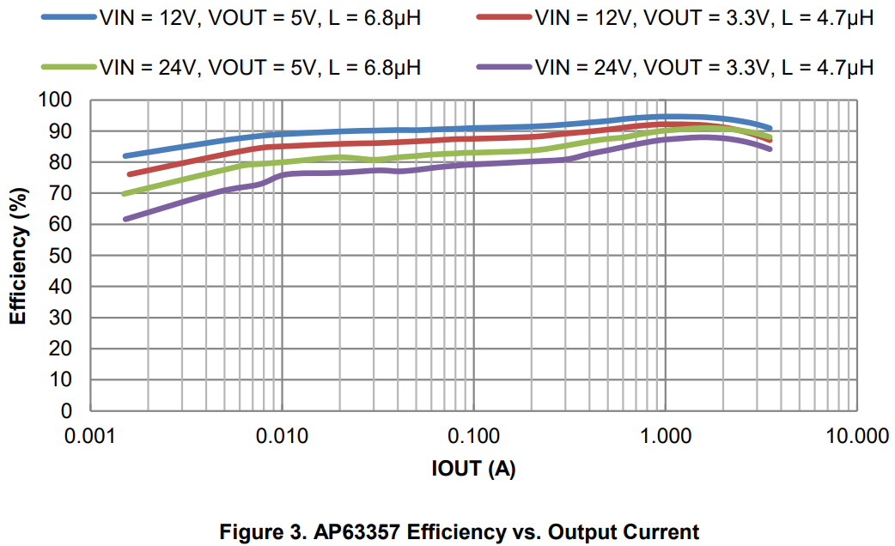{ width=400 }](../img/hookup_guide/AP63357-efficiency.png "Click to enlarge")
	<figcaption markdown>
	Figure 3 from the [datasheet](../component_documentation/AP63356-AP63357.pdf).
	</figcaption>
	</figure>

??? tip "Line and Load Regulation"
	Users should expect a line and load regulation close to the charts presented in Figures 27 and 28 in the [datasheet](../component_documentation/AP63356-AP63357.pdf) *(i.e. 5.0 &plusmn;0.2V)*. While these vary with the load current and cooling, we didn't see an output voltage below 5V in our tests.
	
	Additionally, we will note that there is some noise in the output voltage, due to the switching of the regulator. While this increases with the load current, for most users it won't be relevant to their use case.

	<figure markdown>
	[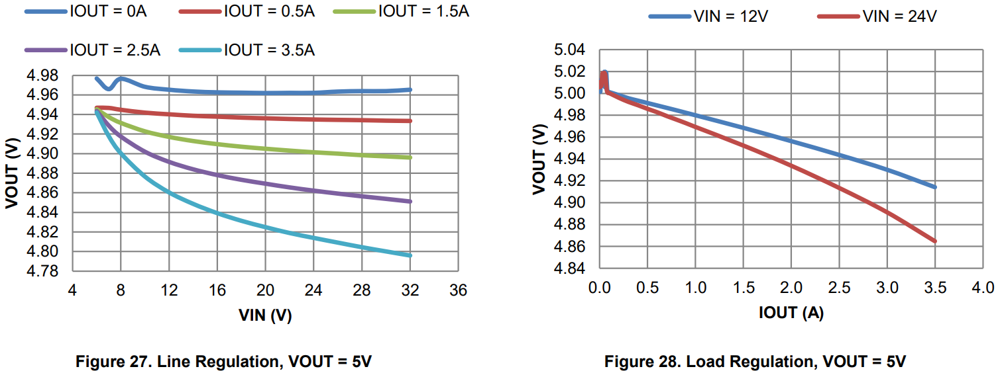{ width=400 }](../img/hookup_guide/AP63357-line_load_reg.png "Click to enlarge")
	<figcaption markdown>
	Figures 27 and 28 from the [datasheet](../component_documentation/AP63356-AP63357.pdf).
	</figcaption>
	</figure>

###  Undervoltage Lockout
An undervoltage lockout is implemented to prevent the IC from insufficient input voltages. The AP63357 device has a UVLO comparator that monitors the input voltage and disables it when the input voltage falls below 3.08V. Some applications may desire higher `VIN` UVLO threshold voltages than is provided by the default setup. A pull-up current source on the `EN` pin, along with an external resistive divider (R3 and R4) configure the `VIN` UVLO threshold voltage, as shown in **Figure 37** of section **5 - Adjusting Undervoltage Lockout (UVLO)** of the [datasheet](../component_documentation/AP63356-AP63357.pdf).

The resistive divider's resistor values are calculated by:

\begin{align}
    R3 = \frac{ 0.915 * V_{ON} - V_{OFF} }{ 4.127 \mu A } \tag{ Eq. 2 } \label{eq:2} \\
    R4 = \frac{ 1.08 * R3 }{ V_{OFF} - 1.08V + 5.5 \mu A * R3 } \tag{ Eq. 3 } \label{eq:3}
\end{align}

Where:

(1) V~ON~ is the rising edge VIN voltage to enable the regulator and is greater than 3.6V 
(2) V~OFF~ is the falling edge VIN voltage to disable the regulator and is greater than 3.18V
{ .annotate }

1.	Configured at 5.6V
2.	Configured at 5.18V

!!! tip
	While the undervoltage lockout is configured for **5.6V** on the high end, users should provide at least **6V** for the input voltage. Based on testing, we found **6V** to be a more realistic expectation to avoid an undervoltage lockout from the boards.

## Heat Sink Pad
!!! hot "**Danger:** These boards can get extremely **HOT** :material-thermometer-alert:"
	
	Please handle these boards with the utmost caution. Users can easily burn themselves when the board outputs anything over 2A. 

A platted copper pad is provided on the back of the boards, where users can add a heat sink to dissipate excess heat generated by the AP63357. While the pad size is slightly different between each board, they both can accommodate the [copper heatsink](https://www.sparkfun.com/products/18704) in our catalog.

* Buck: 0.5" x 0.6"
* BabyBuck: 0.435" x 0.5"

<table class="pdf">
	<tr>
		<td align="center">
			<a href="../img/hookup_guide/buck-heat_sink.jpg">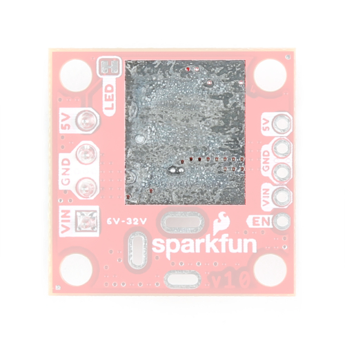</a> 
			<i>Heat sink pad on the back of the 5V Buck Regulator (AP63357DV).</i>
		</td>
		<td align="center">
			<a href="../img/hookup_guide/baby-heat_sink.jpg">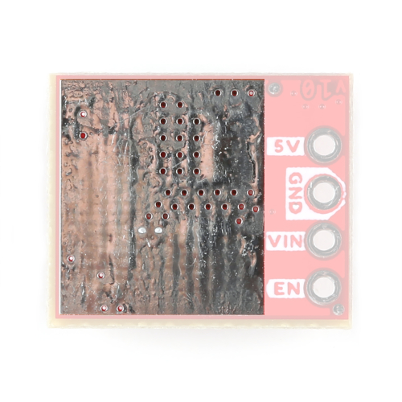</a> 
			<i>Heat sink pad on the back of the 5V Baby Buck Regulator (AP63357DV).</i>
		</td>
	<tr>
</table>

-   <figure markdown>
	
	<figcaption markdown>
	Heat sink pad on the back of the 5V Buck Regulator (AP63357DV).
	</figcaption>
	</figure>

-   <figure markdown>
	
	<figcaption markdown>
	Heat sink pad on the back of the 5V Baby Buck Regulator (AP63357DV).
	</figcaption>
	</figure>

### Thermal Characteristics
??? info "Thermal Shutdown Temperature"
	The AP63357 has a 170&deg;C (338&deg;F) thermal shutdown temperature.

The thermal limitations of the board will dictate the maximum load current our boards can provide. Below is a chart of some testing we have performed using the full-size, [5V Baby Buck Regulator](https://www.sparkfun.com/products/21255) with a [heat sink](https://www.sparkfun.com/products/18704) attached to the back of the board.

<figure markdown>
[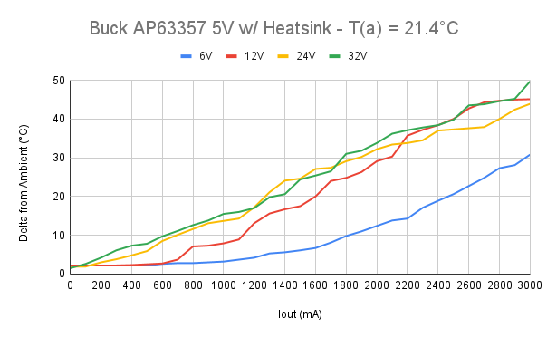](../img/hookup_guide/thermal_characteristics.png "Click to enlarge")
<figcaption markdown>
Thermal characteristics for the [5V Baby Buck Regulator](https://www.sparkfun.com/products/21255) with a [heat sink](https://www.sparkfun.com/products/18704).
</figcaption>
</figure>

!!! info
	For more information on the thermal characteristics of the AP63357, please refer to the [datasheet](../component_documentation/AP63356-AP63357.pdf).

	??? tip "Thermal Limitations on Load Current"
		* Without a heat sink or active cooling, we recommend users not load the boards with more than 1.5A.
		* With a heat sink, we have found users can expect to draw up to 2.5A
		* While the IC is rated up to 3.5A, users may experience thermal limitations towards that maximum.
			* Users should reasonably expect to be able to place a maximum 3A load on the boards when using a heat sink and active cooling (i.e. fan). 
			* At the peak load of 3.5A, users will need sufficient cooling to prevent the IC's [thermal shutdown](#thermal-characteristics "The AP63357 has a 170&deg;C (338&deg;F) thermal shutdown temperature.").

## Jumper
??? note "Never modified a jumper before?"
	Check out our <a href="https://learn.sparkfun.com/tutorials/664">Jumper Pads and PCB Traces tutorial</a> for a quick introduction!
	

		<a href="https://learn.sparkfun.com/tutorials/664">How to Work with Jumper Pads and PCB Traces 
		</a>
	

There is a jumper on the back of the board that can be used to easily modify a hardware connection on the board. *(Not available on baby buck regulator board.)*

* **PWR** - This jumper can be used to remove power to the `PWR` LED. 

<figure markdown>
[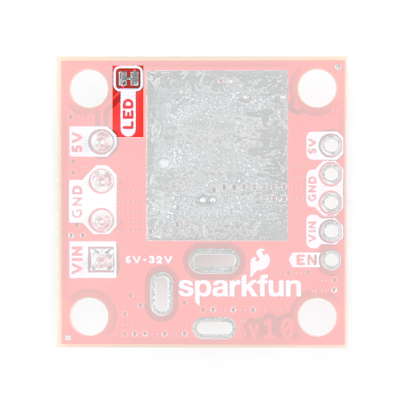{ width="200" }](../img/hookup_guide/buck-jumper.jpg "Click to enlarge")
<figcaption markdown>
The LED jumper on the back of the 5V Buck Regulator (AP63357DV).
</figcaption>
</figure>
