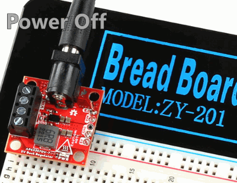

!!! hot "**Danger:** These boards can get extremely **HOT** :material-thermometer-alert:"
	
	Please handle these boards with the utmost caution. Users can easily burn themselves when the board outputs anything over 2A. 

!!! warning "Need Help?"
    If you need technical assistance or more information on a product that is not working as you expected, we recommend heading on over to the [SparkFun Technical Assistance](https://www.sparkfun.com/technical_assistanc) page for some initial troubleshooting.

    

    [SparkFun Technical Assistance Page](https://www.sparkfun.com/technical_assistance){ .md-button .md-button--primary }
    

    
    If you can't find what you need there, the [SparkFun Forums](https://forum.sparkfun.com/index.php) is a great place to search product forums and ask questions.
    
    !!! info "Account Registration Required"
        If this is your first visit to our forum, you'll need to create a [Forum Account](https://forum.sparkfun.com/ucp.php?mode=register) to post questions.

## Maximum Current
While the AP6337 is rated up to 3.5A, users may experience thermal limitations towards that maximum.

* Users should reasonably expect to be able to place a maximum 3A load on the boards when using a heat sink and active cooling. 
* At the peak load of 3.5A, users will need sufficient cooling to prevent the IC's [thermal shutdown](#thermal-characteristics "The AP63357 has a 170&deg;C (338&deg;F) thermal shutdown temperature.").

!!! note
    * Without a heat sink or active cooling, we recommend users not load the boards with more than 1.5A.
    * With a heat sink, we have found users can expect to draw up to 2.5A
		
## Connecting Batteries
For lower current applications, users can connect a battery as the power source. However, we would only recommend using the 9V [battery products](https://www.sparkfun.com/categories/54) from our catalog.

!!! warning
    Other products such as the [coin cell battery holder](https://www.sparkfun.com/products/12618), [2x18650 battery holder](https://www.sparkfun.com/products/12900), and any of the 4xAA battery holders could technically work. However, we would advise against them for the following reasons:

    * For the [coin cell battery holder](https://www.sparkfun.com/products/12618) and any of the 4xAA battery holders (using [alkaline batteries](https://www.sparkfun.com/products/15201)), users wouldn't be able to use the full capacity of their batteries.
        * The initial total voltage of the batteries would typically be above the nominal 6V and potentially work. However, as the batteries discharged they would eventually cross the 6V UVLO threshold of the buck converter well before they were completely depleted.
        * In short, users would maybe be using ~85% of their battery's total capacity at best.
    * The [18650 lithium ion batteries](https://www.sparkfun.com/products/12895) in our catalog don't include a battery protection circuit. With two batteries in series, they would bypass their cutoff voltage (~3.2V). This would permanently damage the batteries and render them useless.

### Automobile Batteries
While users could connect a 12V car, motorcycle, marine, etc. battery for higher current applications, users may find this [5V/3A Buck Converter](https://www.sparkfun.com/products/18375) easier to mount and connect.

-   <a href="https://www.sparkfun.com/products/18375">**Buck Converter - 8-20V to 5V/3A** 
	COM-18375

	---

	<figure markdown>
	
	</figure></a>

## Bypass the UVLO
!!! info "Default Configuration"
    On our boards, the `EN` pin is used to configure the [UVLO](../hardware_overview/#undervoltage-lockout "Undervoltage Lockout") threshold. Therefore, the power output from the board is enabled by default.

On the 5V Buck Regulator, users can short/jumper the [`VIN`](../hardware_overview/#power "Input Voltage") and [`EN`](../hardware_overview/#power-control "Enable Pin") pins. This will bypass the 6V undervoltage lockout setting and allow users to provide a lower input voltage. However, it should be noted that because this is a step-down converter, the output voltage will then be limited to the voltage of the power supply and may not be 5V *(if the input voltage ≤5V)*.

<figure markdown>

<figcaption markdown>
Jumpering the `EN` and `VIN` pins on the 5V Buck Regulator to bypass the UVLO to use an input voltage below 6V.
</figcaption>
</figure>